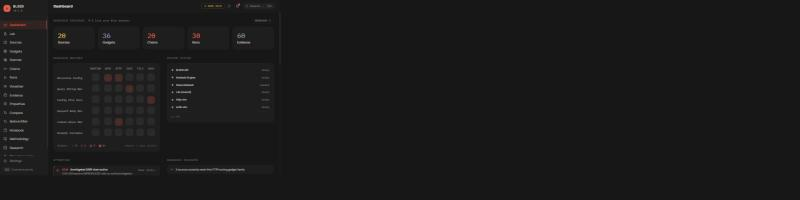
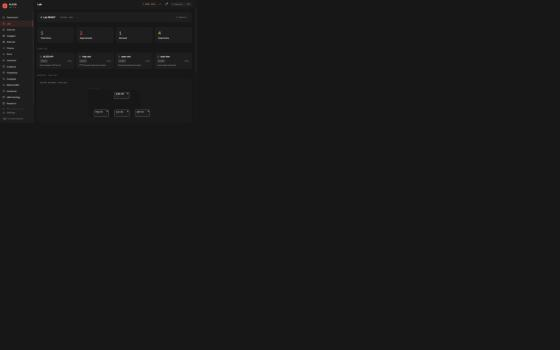
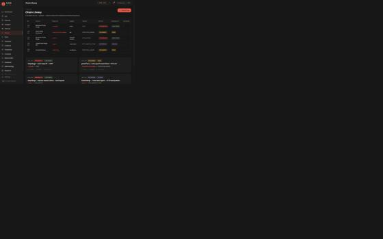
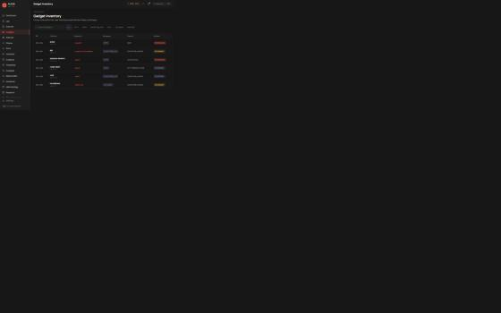
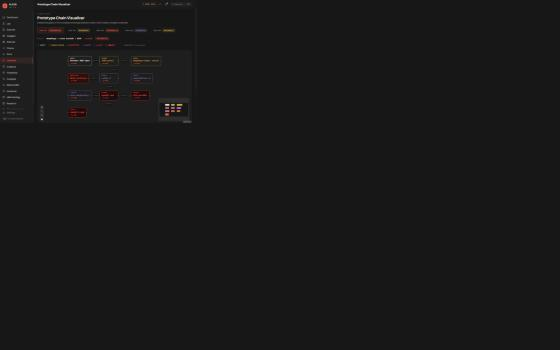
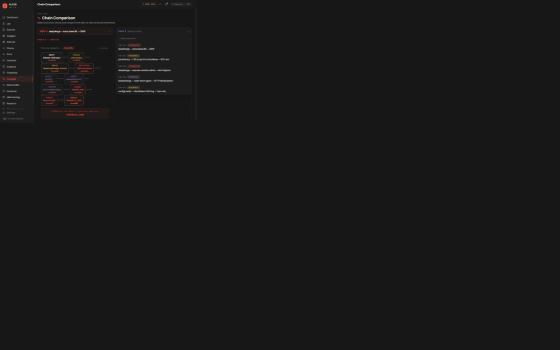

<div align="center">


# BLEED

**Server-Side Prototype Pollution Research Platform**

A full-stack security research workstation for studying, reproducing, and mitigating  
Server-Side Prototype Pollution (SSPP) attacks in Node.js applications.

[](https://www.typescriptlang.org/)
[](https://react.dev/)
[](https://vitejs.dev/)
[](https://expressjs.com/)
[](https://docs.docker.com/compose/)



</div>

---

## What is BLEED?

BLEED is a portfolio-grade security research IDE built to make prototype pollution exploits **visible, reproducible, and teachable**. It ships with a real Docker-isolated lab environment — a deliberately vulnerable Node.js app and its hardened counterpart — so you can watch an attack succeed on one and get blocked on the other, side-by-side, with full execution telemetry.

### The Prototype Pollution Model

```
SOURCE ──▶ PROPERTY ──▶ PROTOTYPE ──▶ GADGET ──▶ CONTROLLED IMPACT
(deepMerge)  (__proto__.X)  (Object.prototype)  (axios baseURL)  (SYNTHETIC_SSRF)
```

Every attack in the lab follows this chain. BLEED visualizes each step, captures evidence, and tracks mitigations.

> **Safety**: All lab impacts are synthetic and local — no real credential theft, no arbitrary external targets, no internet-wide scanning. Synthetic secrets use `LAB_` prefixes. The Docker network is `internal: true`.

---

## Features

### Research Lab
- **12 live attack scenarios** — deepMerge SSRF, config-file injection, express-session privilege escalation, lodash merge, qs parser, and more
- **Real execution** — payloads run against a Docker-isolated vulnerable Node.js app
- **Hardened comparison** — each scenario runs against both vulnerable and hardened variants
- **Full event timeline** — INPUT_RECEIVED → MERGE_EXECUTED → PROTOTYPE_POLLUTED → GADGET_TRIGGERED → IMPACT_EXECUTED

### Intelligence Pages
- **Source Library** — 20 pollution sources with CVE references, code snippets, severity ratings
- **Gadget Inventory** — 36 gadgets mapped to impact categories (ROUTING, AUTH, HTTP, EXECUTION_SIM, FILE, CALLBACK)
- **Chain Library** — 20 exploit chains with animated step-by-step path visualizations
- **Property Intelligence** — per-property deep-dive: all sources, chains, gadgets, mitigations, and evidence
- **Prototype Chain Visualizer** — React Flow graph of the full chain topology

### Analysis Tools
- **Chain Comparison** — pick any two chains and compare them across 10 dimensions side-by-side
- **Before / After** — watch a scenario exploit a vulnerable app, then see the hardened variant block it
- **Research Heatmap** — sources × gadget categories matrix showing attack surface coverage
- **Dependency Scanner** — detect vulnerable merge/parse patterns in package dependency trees
- **Research Runs** — full audit trail of every execution with timestamps, events, and evidence

### Platform UX
- **Showcase mode** — auto-advancing 8-slide demo at `/showcase`, keyboard navigable
- **Keyboard shortcuts** — `d`/`l`/`g`/`c`/`e`/`r`/`v`/`s`/`p` for single-key navigation
- **Demo / Live toggle** — switch between synthetic dataset and live Docker lab
- **Animated refresh** — relative-timestamp dataset refresh with toast notifications
- **Notification center** — dropdown with run completions, blocked chains, and evidence captures
- **Bookmarks** — save any source, chain, or gadget to your Research Library
- **Research Notebook** — freeform Markdown notes alongside your investigation

---

## Screenshots

<table>
<tr>
<td width="50%">

**Research Lab** — Execute real SSPP attacks against Docker-isolated fixtures. Watch exploitation succeed on vulnerable, blocked on hardened.



</td>
<td width="50%">

**Chain Library** — 20 exploit chains with status badges, propagation depth, and animated path visualization.



</td>
</tr>
<tr>
<td width="50%">

**Gadget Inventory** — 36 gadgets sorted by severity, mapped to impact categories with real CVE references.



</td>
<td width="50%">

**Prototype Chain Visualizer** — Interactive React Flow graph showing the full source → prototype → gadget → impact topology.



</td>
</tr>
<tr>
<td width="50%">

**Before / After Hardening** — Side-by-side vulnerable vs hardened execution. The BLOCKED banner shows exactly where mitigation fires.


</td>
<td width="50%">

**Chain Comparison** — Pick two chains, compare them across source, property, depth, gadget, impact, confidence, and evidence.



</td>
</tr>
<tr>
<td width="50%">

**Property Intelligence** — Every chain, gadget, source, and evidence record for a specific polluted property.


</td>
<td width="50%">

**Showcase Mode** — Auto-playing 8-slide demo at `/showcase`. Full keyboard navigation, pause/play, progress dots.


</td>
</tr>
</table>

---

## Architecture

```
bleed/
├── apps/
│   ├── web/          # React 18 + TypeScript + Vite frontend (port 3000)
│   └── api/          # Node.js 20 + Express REST API (port 4001)
├── packages/
│   ├── shared/       # Types, interfaces, constants — shared across all workspaces
│   ├── chain-engine/ # Builds ChainNode graphs from scenario definitions
│   ├── runtime-model/# Prototype baseline capture, pollution detection, restore
│   ├── gadget-engine/# Gadget registry and impact classification
│   └── evidence/     # Run storage, event creation, evidence capture
└── lab/
    ├── vulnerable-app/   # Intentionally unsafe Node.js app (port 4010)
    ├── hardened-app/     # Patched counterpart (port 4011)
    ├── http-sim/         # Synthetic SSRF target (port 4020)
    ├── auth-sim/         # Synthetic auth endpoint (port 4021)
    └── metadata-sim/     # Synthetic cloud metadata service (port 4022)
```

### Frontend stack
| Layer | Choice |
|---|---|
| Framework | React 18 + TypeScript |
| Build | Vite 6 |
| State | Zustand (runs store + app store) |
| Animation | Framer Motion |
| Graph | React Flow (@xyflow/react) |
| Styles | Tailwind CSS with custom design tokens |
| Icons | Lucide React |

### Color system
| Token | Hex | Role |
|---|---|---|
| `graphite` | `#171717` | Background |
| `ivory` | `#F5F0E7` | Primary text |
| `coral` | `#E45D4B` | Danger, attacks, polluted |
| `marigold` | `#D6A944` | Warning, caution |
| `sage` | `#7F9B80` | Success, hardened, blocked |
| `iris` | `#9082B0` | Info, analysis |

---

## Getting Started

### Prerequisites

- Node.js 20+
- npm 9+
- Docker + Docker Compose (for live lab mode)

### Quick start — Demo mode (no Docker)

```bash
git clone https://github.com/het-P301204/bleed.git
cd bleed
npm install
npm run dev --workspace=apps/web
```

Open [http://localhost:3000](http://localhost:3000) — the platform runs in **Demo mode** with a full synthetic dataset: 20 sources, 36 gadgets, 20 chains, 12 scenarios, 60 evidence records, 30 research runs.

### Full lab mode (with Docker)

```bash
# Start everything
docker compose up -d

# Or run web + API in dev mode against the Docker lab
npm run dev --workspace=apps/web &
npm run dev --workspace=apps/api
```

Open [http://localhost:3000](http://localhost:3000) and click **Launch Local Lab** in the `[ DEMO DATA ]` topbar pill to switch to live mode.

### Environment variables

| Variable | Default | Description |
|---|---|---|
| `BLEED_API_TOKEN` | *(unset)* | Bearer token for API auth. Not required in dev. |
| `CORS_ORIGINS` | `http://localhost:4000,http://localhost:5173` | Comma-separated allowed origins |
| `VULNERABLE_APP_URL` | `http://localhost:4010` | Vulnerable fixture URL (Docker: `http://vulnerable-app:4010`) |
| `HARDENED_APP_URL` | `http://localhost:4011` | Hardened fixture URL |

---

## Research Dataset

The demo dataset covers the full prototype pollution attack surface:

| Category | Count |
|---|---|
| Pollution Sources | 20 |
| Gadgets | 36 |
| Exploit Chains | 20 |
| Attack Scenarios | 12 |
| Evidence Records | 60 |
| Research Runs | 30 |

**Source libraries covered**: `lodash.merge`, `deepmerge`, `lodash.set`, `qs`, `flat`, `hoek`, `mixin-deep`, `defaults-deep`, `merge`, `extend`, `node-extend`, `recursive-merge`, `assign-deep`, `config-file`, `body-parser-json`, `express-validator`, `fast-json-stringify`, `superagent`, `needle`, `phin`

**Gadget categories**: Routing (SSRF via `axios.baseURL`), Auth (session flags via `express-session`), HTTP method override, Execution simulation, File path injection, Callback hijacking

---

## Security

BLEED itself is hardened against the attacks it studies:

- **No `eval()` or `new Function()`** anywhere in frontend or API source
- **Strict TypeScript** — `strict: true`, `noUncheckedIndexedAccess`, `exactOptionalPropertyTypes`
- **Serialized prototype operations** — concurrent scenario runs queue behind a mutex; `Object.prototype` is never in a race
- **Input validation** — oversized body rejection, path traversal detection on path + params + query + body, `labTarget` allowlist
- **Docker network isolation** — `internal: true`; lab containers cannot make outbound internet requests
- **API auth** — optional bearer token via `BLEED_API_TOKEN` env var
- **Error sanitization** — internal errors logged server-side only; generic message returned to callers in production

### Responsible use

BLEED is a **local research tool**. The lab fixtures are intentionally vulnerable but isolated to Docker. Do not expose the API (port 4001) or lab ports (4010–4022) to untrusted networks.

---

## Pages

| Route | Page | Description |
|---|---|---|
| `/` | Landing | Entry point with project overview |
| `/dashboard` | Dashboard | Metrics, heatmap, activity feed, attention center |
| `/lab` | Research Lab | Run 12 live attack scenarios |
| `/sources` | Source Library | 20 pollution source packages |
| `/gadgets` | Gadget Inventory | 36 gadgets with impact classification |
| `/chains` | Chain Library | 20 exploit chains with animations |
| `/visualizer` | Visualizer | React Flow chain topology graph |
| `/runs` | Research Runs | Full audit trail of all executions |
| `/evidence` | Evidence | Captured proof-of-exploitation records |
| `/properties` | Property Intelligence | Per-property source/chain/gadget/evidence view |
| `/compare` | Chain Comparison | Side-by-side 10-dimension chain analysis |
| `/before-after` | Before / After | Vulnerable vs hardened scenario replay |
| `/showcase` | Showcase | Auto-advancing 8-slide portfolio demo |
| `/scanner` | Dependency Scanner | Detect vulnerable patterns in npm trees |
| `/notebook` | Research Notebook | Freeform Markdown investigation notes |
| `/inspector` | Object Inspector | Live `Object.prototype` state viewer |
| `/methodology` | Methodology | Research methodology and taxonomy |
| `/research` | References | CVEs, writeups, and research links |

---

## Keyboard Shortcuts

| Key | Page |
|---|---|
| `d` | Dashboard |
| `l` | Lab |
| `g` | Gadgets |
| `c` | Chains |
| `e` | Evidence |
| `r` | Runs |
| `v` | Visualizer |
| `s` | Sources |
| `p` | Properties |

---

## License

MIT — see [LICENSE](LICENSE) for details.

---

<div align="center">

Built as a security research portfolio project.  
Demonstrating JS runtime internals, prototype chain mechanics, and defensive mitigation techniques.

</div>
